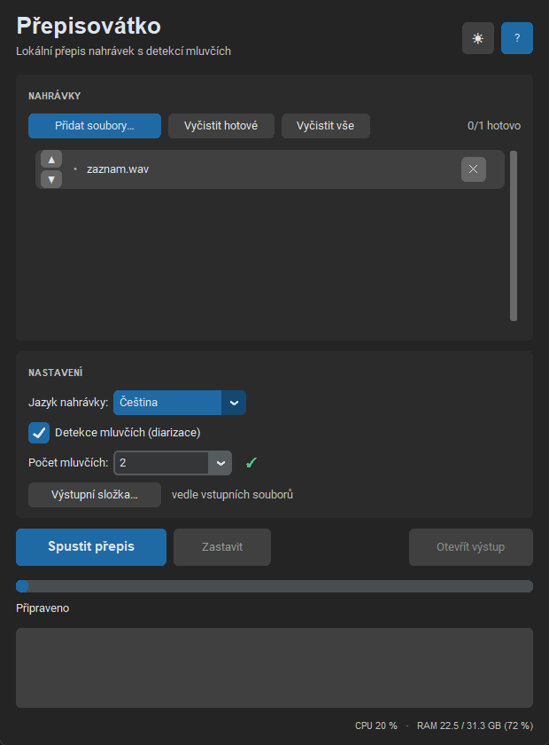

# Přepisovátko

**Lokální (offline) přepis nahrávek z porad s detekcí mluvčích.**
Vše běží na vašem počítači — nic se neposílá na internet.



---

## Co to umí

- 🎙️ **Přepis řeči do textu** v kvalitě OpenAI Whisper (model `large-v3-turbo`)
- 👥 **Detekce mluvčích** (diarizace) — kdo kdy mluví; počet mluvčích automaticky, nebo zadáte ručně
- 🌍 **Více jazyků** — čeština, angličtina, slovenština, němčina, francouzština, polština + auto-detekce
- 🎬 **Audio i video** na vstupu — mp3, wav, m4a, flac, ogg… i mp4, mkv, mov, avi, webm (vytáhne se zvuková stopa)
- 📄 **Výstup** do `.txt` (čistý přepis) a `.srt` (titulky s časy)
- 📚 **Slovník výrazů** — jména účastníků, zkratky a termíny, které má přepis znát (ČSSZ, OSVČ, Dvořáková…)
- ⚡ **Volitelný výkon** — Na pozadí / Vyvážený / Plný, přepínatelné i během přepisu (na PC se dá dál pracovat)
- 📂 **Dávkové zpracování** — fronta souborů, kterou lze upravovat i za běhu
- 🔒 **Plně offline** — žádný internet, žádný účet, žádná instalace, bez admin práv
- 🖥️ **CPU-only** — funguje na běžných noteboocích (AMD i Intel), nepotřebuje grafickou kartu

## Stažení (hotová aplikace)

Hotový portable balíček pro Windows najdete v sekci
**[Releases](../../releases/latest)** — stáhněte ZIP, rozbalte kamkoli
a spusťte `Přepisovátko.bat`. Žádná instalace.

> Balíček obsahuje vše potřebné (Python, modely, ffmpeg) a má kolem 850 MB.

## Jak to použít

1. Přidejte nahrávky tlačítkem nebo je přetáhněte do okna.
2. Vyberte jazyk nahrávky a zda chcete detekci mluvčích.
3. Spusťte přepis. Výsledek (`.txt` a `.srt`) se uloží vedle vstupu nebo do zvolené složky.

Během přepisu je procesor vytížený naplno — počítač může být po tu dobu pomalejší.
Přepis trvá zhruba 0,5–0,7× délky nahrávky, diarizace přidá ~0,1×.

## Sestavení ze zdrojů

Repozitář obsahuje pouze zdrojový kód (od v1.2.0 multiplatformní — Windows i macOS).

- **Windows** portable balíček: postup v **[BUILD.md](BUILD.md)**
- **macOS (Apple Silicon)** `.app`: kompletní postup v **[MAC_BUILD.md](MAC_BUILD.md)**
  (napsaný tak, aby podle něj build zvládl i Claude Code)

Pro vývoj stačí:

```bash
pip install -r requirements.txt
python prepisovatko/gui.py
```

(Navíc je potřeba `whisper-cli.exe` + modely v `prepisovatko/bin/` a `prepisovatko/models/` — viz BUILD.md. Ve vývoji se použije ffmpeg ze systémové PATH.)

## Technologie

| Část | Nástroj | Licence |
|------|---------|---------|
| Přepis | [whisper.cpp](https://github.com/ggml-org/whisper.cpp) + Whisper model | MIT |
| Detekce mluvčích | [sherpa-onnx](https://github.com/k2-fsa/sherpa-onnx) (pyannote segmentace + NeMo TitaNet) | Apache-2.0 / viz modely |
| Konverze audia/videa | [ffmpeg](https://ffmpeg.org/) | LGPL/GPL dle buildu |
| GUI | [CustomTkinter](https://github.com/TomSchimansky/CustomTkinter) + tkinterdnd2 | MIT |

## Licence

Kód aplikace: viz [LICENSE](LICENSE). Přibalené komponenty třetích stran
(whisper.cpp, sherpa-onnx, modely, ffmpeg) mají vlastní licence — viz tabulka výše
a soubory u jednotlivých modelů v balíčku.

## Autor

S pomocí AI vytvořil **Antonín Lerek** v roce 2026 · tnlrk@tnlrk.cz
